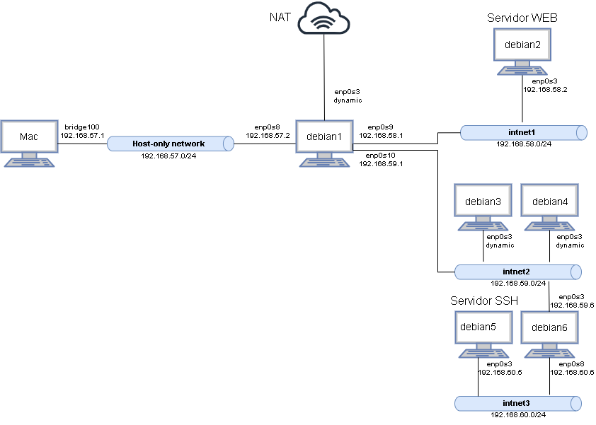
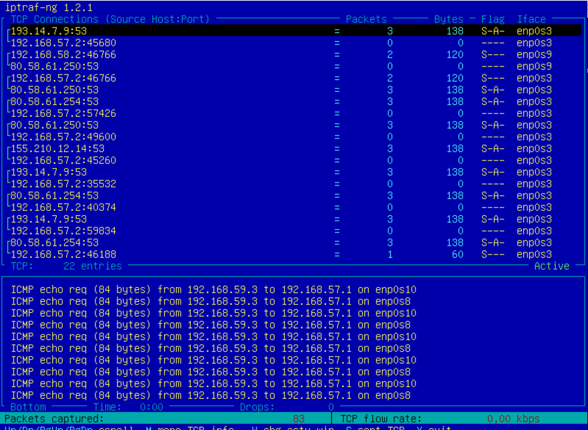
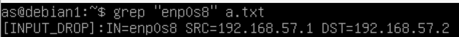
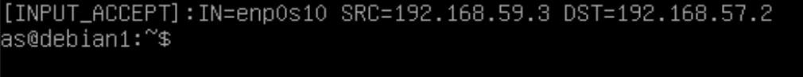

# Memoria del trabajo obligatorio final

## Índice

## Creación de máquinas

En primer lugar, importamos una nueva máquina (as_base_iptables.ova) y descargamos sudo en ella, dando privilegios de administración al usuario as. A continuación, liberamos el disco de dicha máquina y hacemos multiconexión. Para ello:
```
archivo -> Administrador de medios virtuales -> liberar
```
Una vez liberado el disco, seleccionamos la opción multiconexión.

Creamos, a continuación, 6 nuevas máquinas virtuales. Para ello:
```
Nueva -> Usar un archivo de disco virtual existente. 
```
Seleccionamos el disco que hemos liberado y convertido a multiconexión y les asignamos nombres: debian1-debian6. 

Una vez creadas, vamos a hacer es cambiar el nombre de las máquinas (lo que aparece en el prompt) para poder distinguirlas mejor. Esto se hace modificando los ficheros ```etc/hostname``` y ```etc/hosts```. Nótese que debe hacerse con permisos de administrador, pues son ficheros de sólo lectura. A modo de ejemplo, en el fichero `etc/hostname` de la máquina **debian1** escribimos la línea:

```bash 
debian1
```

El fichero `etc/hosts` de esa misma máquina debe quedar como sigue:

```bash
127.0.0.1   localhost
127.0.1.1   debian1
```

Repetimos lo anterior con todas las máquinas. 


## Configuración de red

La configuración de red se puede ver en la siguiente imagen:



Para especificar esta estructura de red vamos a modificar el fichero `/etc/network/interfaces` (se especificará más adelante cómo). 
Tras modificar los ficheros `/etc/network/interfaces` de cada máquina, usamos el comando:
```bash
systemctl restart networking.service
```
para que los cambios tengan efecto, y el comando 
```bash
ip addr
```
para comprobar que las máquinas se conectan a todos sus interfaces de red.

Se explican a continuación los cambios realizados en el fichero `/etc/network/interfaces` a cada una de las máquinas

### Debian1
Empezamos por debian1:
```bash
# NAT
allow-hotplug enp0s3
iface enp0s3 inet dhcp

# Host-Only Network
auto enp0s8
iface enp0s8 inet static
address 192.168.57.2
netmask 255.255.255.0

# Internal network 1
auto enp0s9
iface enp0s9 inet static
address 192.168.58.1
netmask 255.255.255.0

# Internal network 2
auto enp0s10
iface enp0s10 inet static
address 192.168.59.1
netmask 255.255.255.0

up ip route add 192.168.60/24 via 192.168.59.6 dev enp0s10
up ip route add default via 192.168.57.1 dev enp0s8
```

### Debian2

```bash
auto enp0s3
iface enp0s3 inet static
address 192.168.58.2
netmask 255.255.255.0
up ip route default via 192.168.58.1 dev enp0s3
```

### Debian3-4

```bash
auto enp0s3
iface enp0s3 inet dhcp
up ip route add 192.168.60.0/24 via 192.168.59.6 dev enp0s3
up ip route add default via 192.168.59.1 dev enp0s3
```

### Debian5

```bash
auto enp0s3
iface enp0s3 inet static
up ip route add default via 192.168.60.6 dev enp0s3
```

### Debian6

```bash
auto enp0s3
iface enp0s3 inet static
address 192.168.59.6
netmask 255.255.255.0

auto enp0s8
iface enp0s8 inet static
address 192.168.60.6
netmask 255.255.255.0

up ip route add default via 192.168.59.1
```

# Servidor DHCP

Instalamos en **debian1** el servidor DHCP usando:

```bash
sudo apt-get install isc-dhcp-server
```

Ahora añadirmos en el fichero de configuración `/etc/dhcp/dhcpd.conf` la configuración del servidor:

```bash
subnet 192.168.59.0 netmask 255.255.255.0 {
 range 192.168.59.3 192.168.59.9;
 option routers 192.168.59.1;
 option domain-name-servers 10.0.2.3, 192.14.7.9;
 option domain-name "carlos.org";
}
```
Es importante aumentar el tiempo de expiración de las direcciones dinámicas modificando el valor de `default-lease-time` a por ejemplo `7200` segundos, es decir, dos horas.

# Router

Tenemos que activar el ip_forwarding de la máquina **debian1** y **debian6** para que puedan reexpedir paquetes. Para ello escribimos en el fichero `/etc/sysctl.conf` la siguiente linea:
```bash 
net.ipv4.ip_forward=1
``` 
Por último tenemos que hacer permanentes los cambios con la instrucción 
```bash
sudo sysctl -p /etc/sysctl.conf
```

# Servidor Web

Primero instalamos el servidor web apache en **debian2** con 
```bash
sudo apt update
sudo apt install apache2
``` 
Para modificar el fichero `html` modificamos el fichero `/var/www/html/index.html`. El servidor se arranca con la máquina automáticamente

# Servidor SSH

Primero instalamos el servidor ssh **debian5** con

```bash 
sudo apt install openssh-server
```
y modificamos el fichero de configuración `/etc/ssh/sshd_config` añadiendo las lineas:

```bash
PermitRootLogin no
RhostsAuthentication no
RhostsRSAAuthentication no
RSAAuthentication yes
PasswordAuthentication yes
```

El servidor se arranca automáticamente con la máquina.

# Cortafuegos
Escribimos a continuación las instrucciones de firewall necesarias:

```bash

# TABLA FILTER
# Inicializamos la tabla rechanzado por defecto todo input y forward
iptables -F 
iptables -P INPUT DROP
iptables -P FORWARD DROP
iptables -P OUTPUT ACCEPT
# Permitimos tráfico desde intranet a extranet (y/o intranet)
iptables -A FORWARD -i enp0s9 -j ACCEPT
iptables -A FORWARD -i enp0s10 -j ACCEPT
## Para que se pueda conectar con debian1
iptables -A INPUT -i enp0s9 -j ACCEPT
iptables -A INPUT -i enp0s10 -j ACCEPT
## Permitir pings desde host SOLO DE RESPUESTA
iptables -A INPUT -i enp0s8 -p icmp --icmp-type 0 -j ACCEPT
## Permitir loop-back
iptables -A INPUT -i lo -d 127.0.0.1 -j ACCEPT
## Permitir conexiones ssh y http
iptables -A FORWARD -d 192.168.58.2 -p tcp --dport 80 -j ACCEPT # HTTP
iptables -A FORWARD -d 192.168.58.2 -p tcp --dport 22 -j ACCEPT # SSH
## Respuestas de ping de extranet
iptables -A INPUT -i enp0s3 -p icmp -j ACCEPT # A debian1
iptables -A FORWARD -i enp0s3 -p icmp -j ACCEPT # A otro debian

# TABLA NAT

# Inicializamos la tabla
iptables -t nat -F
# Cambiar IP origen de tráfico extranet a intranet a IP pública de firewall. 
iptables -t nat -A POSTROUTING -o enp0s3 -j SNAT --to-source 192.168.57.2
# Cambiar destino de conexiones al servidor web debian2
iptables -t nat -A PREROUTING -i enp0s8 -p tcp --dport 80 -j DNAT --to 192.168.58.2
# Cambiar destino de conexiones al servidor ssh debian5
iptables -t nat -A PREROUTING -i enp0s8 -p tcp --dport 22 -j DNAT --to 192.168.60.5

``` 

 Para que los cambios sean persistentes, instalamos `iptables-persistent` y después, guardamos la configuración con el siguiente comando en **root** (una vez ejecutado el script del cortafuefos):

```bash
iptables-save > /etc/iptables/rules.v4
```

# Pruebas

# Tabla de pruebas
Se presenta la tabla de pruebas.


Todas funcionan excepto la número 4. Inspeccionando con `iptraf` hemos visto que el paquete llega a a debian1 y se envía al host. Sin embargo, este no lo devuelve (no se detecta el tráfico incluso con el firewall desactivado). Creemos que tiene algo que ver con la configuración del host que es un ordenador privado mac. Ver



| Test a realizar             | Origen                | Destino               | Resultado obtenido |
|-----------------------------|-----------------------|-----------------------|--------------------|
| ping -c 1 -W 1 192.168.57.2 |   Host 192.168.57.1   | Debian 1 192.168.57.2 |     No responde    |
| ping -c 1 -W 1 192.168.57.1 |        Debian 1       |          Host         |      Responde      |
| ping -c 1 -W 1 192.168.60.5 | Debian 2 192.168.58.2 | Debian 5 192.168.60.5 |      Responde      |
| ping -c 1 -W 1 192.168.57.2 |    Debian 3 dynamic   | Debian 1 192.168.57.2 |     No funciona    |
|       ssh 192.168.57.2      |   Host 192.168.57.1   | Debian 1 192.168.57.2 |     SSSH login     |
|     http://192.168.57.2     |   Host 192.168.57.1   | Debian 1 192.168.57.2 |    HTTP Response   |
|      host www.unizar.es     |  Debian 3 192.168.57  |      Servidor DNS     |    166.210.11.37   |

## Logs

Hemos configurado los logs y hemos podido probar aquellos que no usasen forward, ya que hacemos drop de todo el input y por lo tanto, no se loggean los drops de forward, luego algunas pruebas no se ven reflejadas en los logs. Ponemos capturase de la primera, segunda. EL resto son forwads.




Mostramos el contenido http:


