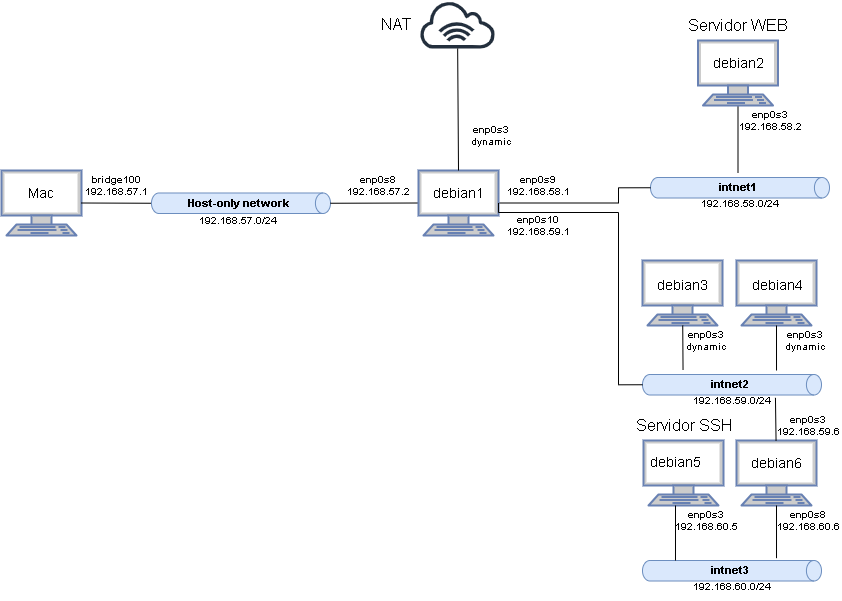

# Memoria del trabajo obligatorio final

## Índice

## Creación de máquinas

En primer lugar, importamos una nueva máquina (as_base_iptables.ova) y descargamos sudo en ella, dando privilegios de administración al usuario as. A continuación, liberamos el disco de dicha máquina y hacemos multiconexión. Para ello:
```
archivo -> Administrador de medios virtuales -> liberar
```
Una vez liberado el disco, seleccionamos la opción multiconexión.

Creamos, a continuación, 6 nuevas máquinas virtuales. Para ello:
```
Nueva -> Usar un archivo de disco virtual existente. 
```
Seleccionamos el disco que hemos liberado y convertido a multiconexión y les asignamos nombres: debian1-debian6. 

Una vez creadas, vamos a hacer es cambiar el nombre de las máquinas (lo que aparece en el prompt) para poder distinguirlas mejor. Esto se hace modificando los ficheros ```etc/hostname``` y ```etc/hosts```. Nótese que debe hacerse con permisos de administrador, pues son ficheros de sólo lectura. A modo de ejemplo, en el fichero `etc/hostname` de la máquina **debian1** escribimos la línea:

```bash 
debian1
```

El fichero `etc/hosts` de esa misma máquina debe quedar como sigue:

```bash
127.0.0.1   localhost
127.0.1.1   debian1
```

Repetimos lo anterior con todas las máquinas. 


## Configuración de red

La configuración de red se puede ver en la siguiente imagen:



Para especificar esta estructura de red vamos a modificar el fichero `/etc/network/interfaces` (se especificará más adelante cómo). 
Tras modificar los ficheros `/etc/network/interfaces` de cada máquina, usamos el comando:
```bash
systemctl restart networking.service
```
para que los cambios tengan efecto, y el comando 
```bash
ip addr
```
para comprobar que las máquinas se conectan a todos sus interfaces de red.

Se explican a continuación los cambios realizados en el fichero `/etc/network/interfaces` a cada una de las máquinas

### Debian1
Empezamos por debian1:
```bash
# NAT
allow-hotplug enp0s3
iface enp0s3 inet dhcp

# Host-Only Network
auto enp0s8
iface enp0s8 inet static
address 192.168.57.1
netmask 255.255.255.0

# Internal network 1
auto enp0s9
iface enp0s9 inet static
address 192.168.58.1
netmask 255.255.255.0

# Internal network 2
auto enp0s10
iface enp0s10 inet static
address 192.168.59.1
netmask 255.255.255.0
```

### Debian2

```bash
auto enp0s3
iface enp0s3 inet static
address 192.168.58.2
netmask 255.255.255.0
up ip route default via 192.168.58.1 dev enp0s3
```

### Debian3-4

```bash
auto enp0s3
iface enp0s3 inet dhcp
up ip route add 192.168.60.0/24 via 192.168.59.6 dev enp0s3
up ip route add default via 192.168.59.1 dev enp0s3
```

### Debian5

```bash
auto enp0s3
iface enp0s3 inet static
up ip route add default via 192.168.60.6 dev enp0s3
```

### Debian6

```bash

```

# Servidor DHCP

Instalamos en **debian1** el servidor DHCP usando:

```
sudo apt-get install isc-dhcp-server
```

# Router


# Cortafuegos

